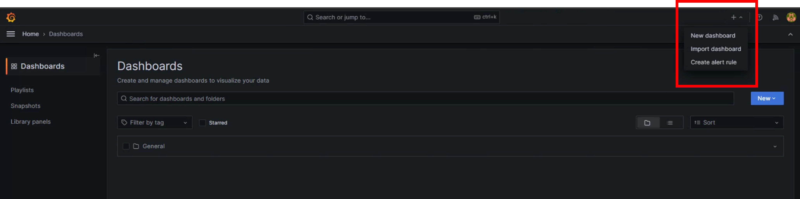

# Installation

This page will guide you to install Grafana and PostgreSQL step by step.

## Grafana installation

- Please go to [Grafana official website](https://grafana.com/grafana/download?pg=get&plcmt=selfmanaged-box1-cta1&platform=windows) to download the Windows version.

## PostgreSQL installation

- Please go to the [PostgreSQL official website](https://www.enterprisedb.com/downloads/postgres-postgresql-downloads) to download the Windows version.

- If the computer name is in Chinese, the installation may fail and the following window will pop up. At this point you can use the [download point](https://get.enterprisedb.com/postgresql/postgresql-11.2-1-windows-x64.exe) to install.

- When installing, please set the password to `admin` and the port to `5432`.

## Grafana setup

- Enter the account `admin` and the password `admin` on the web page.

- Go to `Home` > `Connections` > `Data sources` and click `Add data source`

- Choose PostgreSQL

- Please fill in the following information and select `disable` for TLS/SSL Mode

- Then please click the `+` in the upper right corner and select `import dashboard`, you can start using it after importing it.

